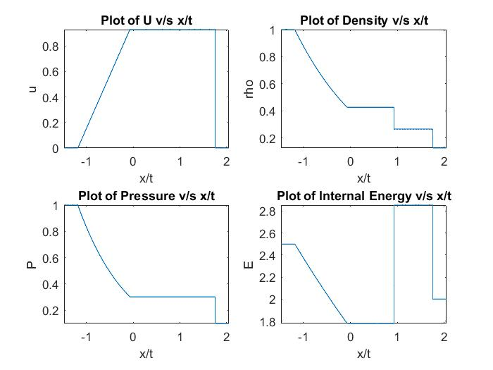
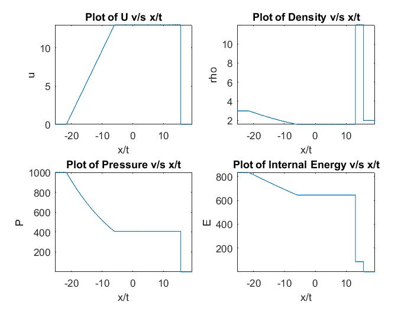
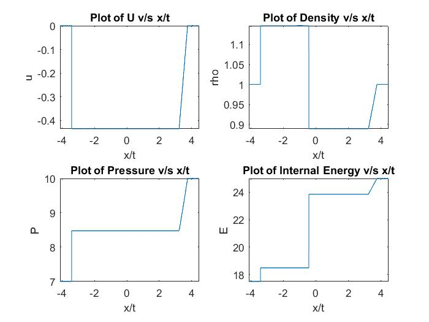
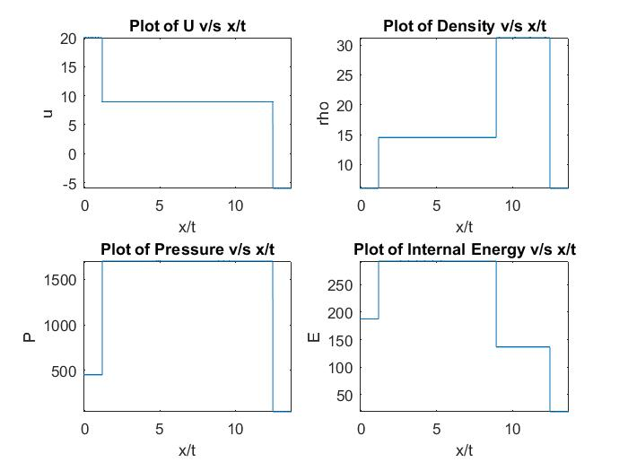
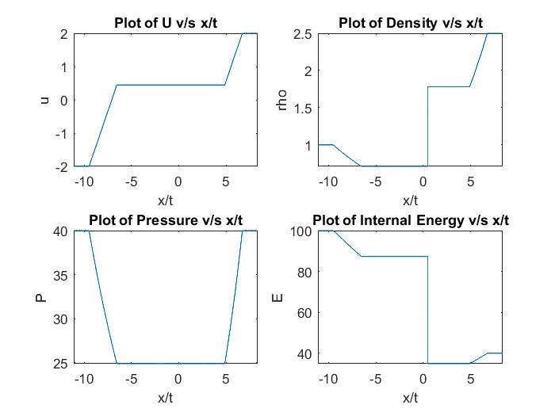

# Riemann Solver

A Riemann problem, named after Bernhard Riemann, is a specific 
initial value problem composed of a conservation equation together
with piecewise constant initial data which has a single discontinuity
in the domain of interest. The Riemann problem is immensely useful 
for the understanding of equations such as Euler conservation 
equations because all properties, namely shocks and rarefaction waves,
appear as characteristics in the solution. It also gives an exact 
solution to some complex nonlinear equations, such as the Euler equations.

In numerical analysis, Riemann problems appear naturally in Finite 
Volume Methods for the solution of conservation law equations due
to the discreteness of the grid. It is, therefore, widely used in 
computational fluid dynamics and computational magnetohydrodynamics 
simulations. In these fields, Riemann problems are calculated using
Riemann solvers.

## Authors

- [Le Dinh Tan](https://github.com/ledinhtan)

## Solution Description

This Riemann solver is used to solve one-dimensional, inviscid flow,
unsteady Euler equations for a shock-tube, in which two gases are
separated by a wall. Upon removal of the wall, a system of shock and 
expansion waves is generated. This constitutes a Riemann initial problem.
My code is an exact solver to solve the Riemann problem and compute
the pressure, density, and velocity outputs. Furthermore, the code
will also show the plots for these quantities in addition to curve
for internal energy versus x = t along the shock-tube.
 
 

## Solution

There are six possible cases of initial values be seleted by the users
in the code for Riemann solver. When one of the cases is selected,
The corresponding values of density, velocity as well as pressure
at the time t = 0 are selected. Then, the speed of sound at given
conditions is calculated.

- Case 1: Sods problem

- Case 2: Left running expansion and right running "STRONG" shock

- Case 3: Left running shock and right running expansion

- Case 4: Double shock

- Case 5: Double expansion

- Case 6: Cavitation is observed in this case of double expansion. No solution possible 

## Programming Language

**Programming language:** Matlab

**Version:** 2014a Version

